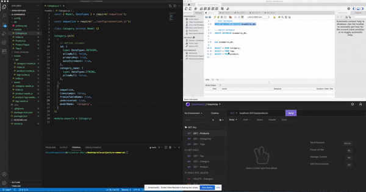

# E-Commerce Backend
  
## Description
This application allows a user(s), to manage their inventory. The user will be able to see items by category, tag, and product. They will be able to see all catergories, or all tags, or all products. They will also be able to pin a product, tag, or category by their id number. The user(s) will be able to modifed a product, category and tag by id. The user(s) will be able to post new categories, products, or tags. Lastly, the user will be able to delete a product, tag or category. This app is for backend use only.
## Table of Contents 
- [Installation](#installation)
- [Usage](#usage)
- [License](#license)
- [Contributors](#contributors)
- [Testing](#test)
- [Questions](#questions)
## Installation
1) Copy code from repo 
2) Make sure to copy all dependencies on the package.json 
3) Run "npm i" on your Terminal or Gitbash 
4) The technologies used for this app include: MySQL2, Sequelize, Express, and Dotenv
## Usage
-  this is demo of the software used
- [Click](https://drive.google.com/file/d/1U6YbNmTOBuVaRidM7KMGi-LQpwo4CJ-P/view) this link watch video walkthrough for this app. 
## License
This application is under the MIT license.  
## Contributors
N/A.
## Testing
This application was tested using This application was tested using Insomnia
## Questions
For more information, please visit [GitHub Profile](https://github.com/agonzalvez/).  
For any questions, you may email me at agonzalvez1@gmail.com.